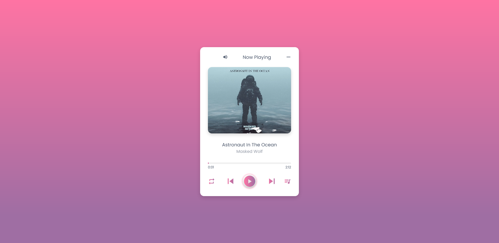

## Table of contents

- [Overview](#overview)
  - [Screenshot](#screenshot)
  - [Links](#links)
- [My process](#my-process)
  - [Built with](#built-with)
- [Author](#author)

## Overview

- A simple music player :)

### Screenshot

### Links

- Live Site URL: [https://santiagomontanaro.github.io/music-player/]

## My process

### Built with

- Semantic HTML5 markup
- CSS3 custom properties
- CSS Grid Layout
- JavaScript

## Author

- Frontend Mentor - [@santiagomontanaro](https://www.frontendmentor.io/profile/santiagomontanaro)
- Twitter - [@santimontana_](https://twitter.com/santimontana_)
- Instagram - [@lllliiiiilllj](https://www.instagram.com/lllliiiiilllj/)
